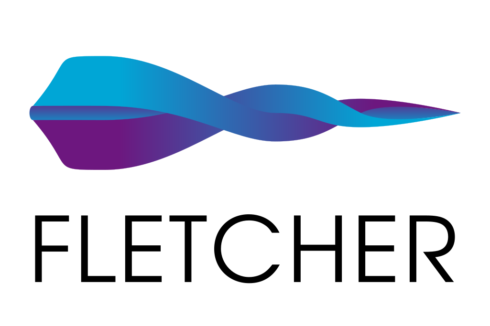

# Chemistry-Aware lDDT Scoring via Command-Line Interface

The `cli` module provides a command-line interface (CLI) for computing chemistry-aware lDDT-like scores between a reference protein structure and one or more query structures. 

## Installation
Ensure you have the required dependencies:

`pip install gemmi scipy matplotlib seaborn`

## Usage
To run the CLI, use the following command:

`python -m fletcher.lddt_cli --ref <path_to_reference_pdb> --query <path_to_query_pdb or path_to_query_directory> --target_chain <chain_id> --target_res <residue_id> [OPTIONS]`

### Arguments:

- `-ref`: Path to the reference PDB file.
- `-queries`: Path to the query PDB file or directory of PDB files. 
- `-target_chain`: Chain ID of the target residue in the reference structure.
- `-target_res`: Residue ID of the target residue in the reference structure.

### Optional Flags:

- `-distance_cutoff`: Maximum distance (in Å) for considering neighboring residues. Default is 15.0.
- `-min_pairs_required`: Minimum number of residue pairs required for scoring. Default is 3.
- `-lddt_thresholds`: List of thresholds (in Å) for calculating lDDT-like scores. Default is [0.5, 1.0, 2.0, 4.0].
- `-save_results`: Flag to save results to JSON files. Default is True.
- `-results_dir`: Directory to save result files. Default is 'results'.
- `-plot`: Flag to generate and save histograms of scores. Default is True.

## Example

`python -m fletcher.lddt_cli --ref reference.pdb --query query1.pdb --target_chain A --target_res 152 --distance_cutoff 15.0 --min_pairs_required 5 --lddt_thresholds 0.5 1.0 2.0 --save_results --results_dir ./results --plot`

This command will compute the lDDT-like scores between the reference structure and the query structure, considering only residues within 15 Å of the target residue 152 in chain A. The top 10 matching residues will be recorded in JSON files saved in the ./results directory, and histograms of the scores will be generated.

## Output
For each query, the results will be saved in a JSON file named `<query_name>_lddt_top_results.json` in the specified results directory. The JSON file will contain:

- title: A string indicating the top results.
- score_type: The type of scoring used.
- thresholds: The thresholds used for scoring.
- min_pairs_required: The minimum number of pairs required for scoring.
- results: A list of the top 10 matching residues, each with:
  - match_residue: The chain and residue ID of the matching residue.
  - score: The computed lDDT-like score.
  - n_pairs: The number of residue pairs considered.

## Background
Fletcher is not an acronym. It is the surname of the greatest musical catalyst I know: Guy Fletcher (https://www.guyfletcher.co.uk). 

